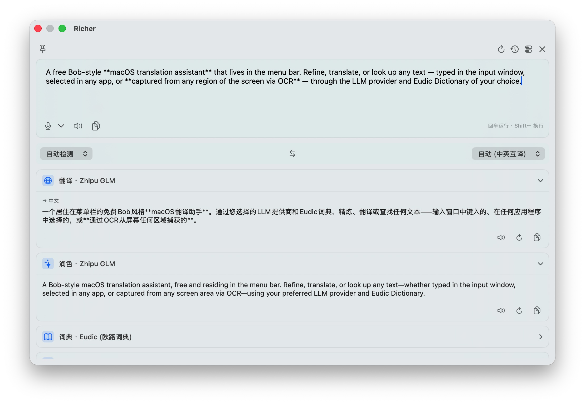
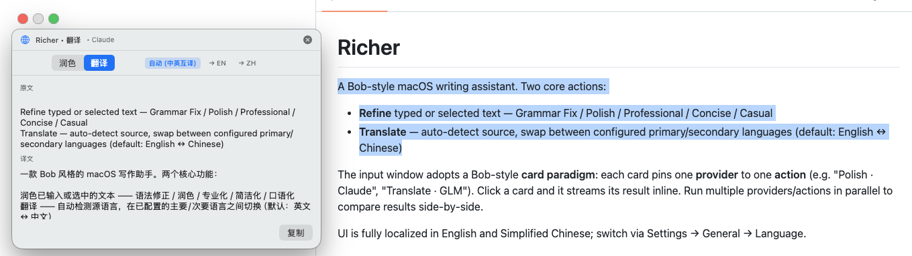
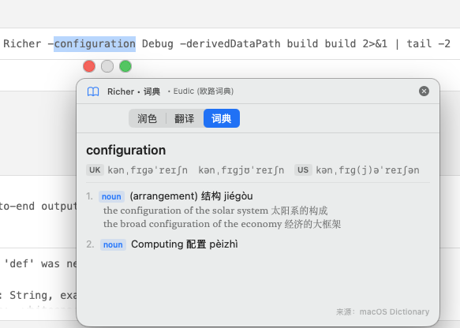

# Richer

A free Bob-style **macOS translation assistant** that lives in the menu bar. Refine or translate any text — typed in the input window, or selected anywhere on screen — through the LLM provider and Eudic Dictionary of your choice.

## Features

- **Refine** — Grammar Fix · Polish · Professional · Concise · Casual
- **Translate** — auto-detect source, swap between configured primary/secondary languages (default: English ↔ Chinese)

### Card paradigm

The input window pins one **provider** to one **action** per card (e.g. *Polish · Claude*, *Translate · GLM*). Click a card to stream its result inline. Run multiple providers/actions in parallel and compare side-by-side.



### Selection popup

Highlight text in any app, hit `⌥⇧R` (refine) or `⌥⇧T` (translate) or `⌥⇧D` (dictionary), and a Bob-style popup appears next to the selection — without stealing focus from the source app.





### Free LLM providers to get started

Richer is BYOK (bring your own key) — but a few providers in the app's list offer **genuinely free** models or new-account quotas, enough to try the app without a budget:

| Provider | App "Kind" | What's free | Sign up |
|---|---|---|---|
| **Zhipu GLM** | *Zhipu GLM* | `glm-4-flash` and `glm-4-flash-x` are free for everyone | [open.bigmodel.cn](https://open.bigmodel.cn/) |
| **Qwen DashScope** | *Qwen* | New accounts get a free token quota across `qwen-turbo` / `qwen-plus` / `qwen-long` etc. | [dashscope.console.aliyun.com](https://dashscope.console.aliyun.com/) |
| **Ollama** (local) | *Ollama* | Fully local — no key, no quota. Pull any model from [ollama.com/library](https://ollama.com/library) and point Richer at `http://localhost:11434`. | [ollama.com](https://ollama.com/) |
| **Google Gemini** | *OpenAI-compatible* | Free tier on `gemini-2.0-flash` and friends. Base URL: `https://generativelanguage.googleapis.com/v1beta/openai/` | [aistudio.google.com](https://aistudio.google.com/) |

> Free quotas and which models are free shift over time — verify on the provider's pricing page before relying on a tier.

## Install

### Option 1 — Download the prebuilt release

1. Grab the latest `Richer-x.y.z.zip` from [Releases](https://github.com/xiahouzuoxin/Richer/releases).
2. Unzip and move `Richer.app` to `/Applications`.
3. The build is **unsigned** (no Developer ID), so on first launch macOS will block it. Strip the quarantine flag once:

   ```sh
   xattr -d com.apple.quarantine /Applications/Richer.app
   open /Applications/Richer.app
   ```

   Or right-click the app → **Open** → **Open** in the dialog.

### Option 2 — Build from source

See the [Develop](#develop) section.

### First-run setup

1. Look for the menu-bar icon — there's no Dock icon by default.
2. **Settings → Providers** — add an LLM provider:
   - Pick a Kind (Claude / OpenAI / DeepSeek / Qwen / Zhipu GLM / OpenAI-compatible / Ollama).
   - Paste your API key — stored in the macOS Keychain.
   - Free-tier hints surface inline (e.g. `glm-4-flash` is free; `qwen-turbo` has a free quota).
3. **Settings → Cards** — click **Suggested** to seed three default cards (Polish · Claude, Grammar Fix · Claude, Translate · Claude). Add more with `+`. Toggle cards on/off without losing their config.
4. **Settings → Hotkeys** — defaults:
   - `⌥⇧R` — refine current selection (popup)
   - `⌥⇧T` — translate current selection (popup)
   - `⌥Space` — open the input window
5. **Grant Accessibility permission** when prompted: *System Settings → Privacy & Security → Accessibility*. The selection-hotkey workflow needs it to synthesize `⌘C` against the focused app.

### After moving / replacing the app

- **Re-grant Accessibility.** Remove any old `Richer` entry and add the new path. Different signing identities (e.g. a new download vs. an old debug build) count as separate apps to macOS.
- **Re-enter API keys.** Keychain entries are bound to the signing identity, so they don't carry over between a debug-signed copy and a release-signed copy.
- **Refresh the icon if it looks stale** — macOS caches icons aggressively:

  ```sh
  killall Dock; killall Finder
  ```

- **Optional — auto-start at login.** *System Settings → General → Login Items → +* → pick `/Applications/Richer.app`.

> **Why isn't this on the Mac App Store?** The selection-popup workflow needs to synthesize `⌘C` and read the pasteboard against another app's process — that requires running outside the App Store sandbox. Bob, PopClip, and similar utilities are off-Store for the same reason.

## Develop

### Prerequisites

- macOS 14+ (Sonoma) — works on macOS 26
- Xcode 15+
- [XcodeGen](https://github.com/yonaskolb/XcodeGen) — `brew install xcodegen`

### Generate the Xcode project

The repo doesn't check in `Richer.xcodeproj`; it's regenerated from [`project.yml`](project.yml).

```sh
xcodegen generate
open Richer.xcodeproj
```

Build & run with ⌘R.

### Build a release `.app`

```sh
xcodegen generate
xcodebuild \
  -project Richer.xcodeproj \
  -scheme Richer \
  -configuration Release \
  -derivedDataPath build \
  build

# .app lands at:
#   build/Build/Products/Release/Richer.app
cp -R build/Build/Products/Release/Richer.app /Applications/
```

### Project layout

```
Richer/
  App/                 # @main, AppDelegate, Coordinator
  Core/
    Input/             # hotkeys (KeyboardShortcuts), selection capture (⌘C trick + AX fallback)
    LLM/               # protocol + streaming + per-provider adapters
    Prompting/         # shared prompt templates
    Keychain/          # API-key storage
    Permissions/       # Accessibility check
  Features/
    Popup/             # NSPanel + SwiftUI popup (selection-hotkey)
    InputWindow/       # NSPanel + SwiftUI input window with cards
    Cards/             # ActionCard model, store, view models, CardRow
    Refine/            # modes + service
    Translate/         # NLLanguageRecognizer + service
    History/           # SwiftData @Model + view
    Settings/          # tabbed Settings scene
  Resources/
    Info.plist
    Assets.xcassets    # app icon + menu bar icon
    Localizable.xcstrings
tools/
  GenerateIcon.swift   # regenerates all icon PNGs
```

### Regenerating the icon

```sh
swift tools/GenerateIcon.swift
xcodegen generate          # so Xcode picks up any new image filenames
```

Produces every `AppIcon.appiconset` size and the monochrome `MenuBarIcon.imageset`.

### Implementation notes

- LLM prompt templates live in [`Richer/Core/Prompting/DefaultPrompts.swift`](Richer/Core/Prompting/DefaultPrompts.swift). Refine modes can also be overridden per-mode in *Settings → Refine*.
- History search uses `localizedStandardContains` over `originalText` and `resultText` — fine up to ~10k entries.
- Provider keys are stored via the legacy macOS keychain (`SecItemAdd` without `kSecUseDataProtectionKeychain`) so they work without a `keychain-access-groups` entitlement.
- The selection popup uses `.nonactivatingPanel` and avoids `NSMenu` so the source app keeps focus. The full language picker only appears in the input window, where the panel is allowed to activate.

## Thanks

- [**Bob**](https://bobtranslate.com/) — the original macOS translation/refinement utility this project takes inspiration from, especially the card paradigm and selection-popup interaction.
